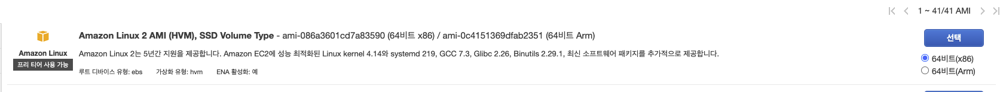
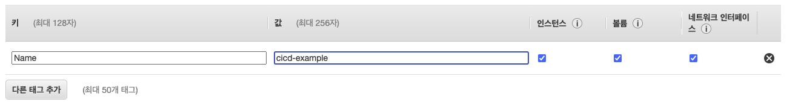
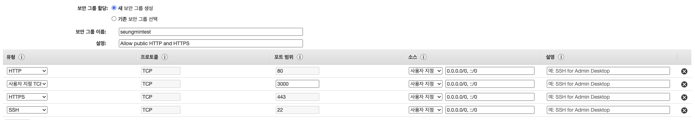
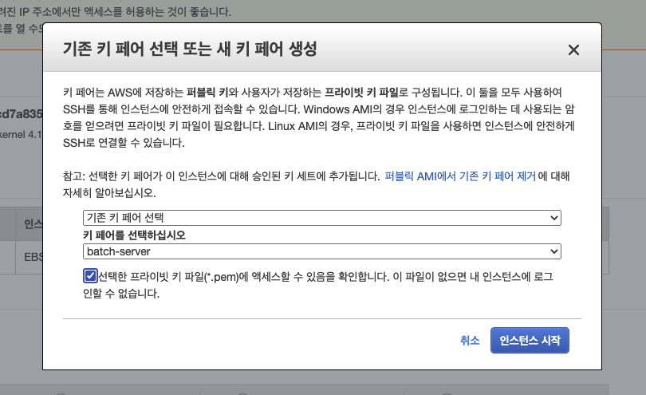
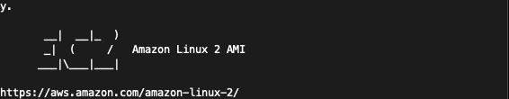

# 👉 CI/CD Example
- Github Action CI/CD example
- [CodeSoom CI/CD Repo](https://github.com/CodeSoom/cicd-example)

## 📚 Settings
- npm install dependencies

```bash
> npm i express
> npm i -D eslint eslint-config-airbnb-base eslint-plugin-import
```

- [Install Docker Desktop on Mac](https://docs.docker.com/docker-for-mac/install/)

### 🎈 Setting for Docker
- 개발하는 환경과 실행하는 환경을 똑같이 일치시키게 하기 위해서 도커를 사용(달라질때마다 어떤 문제가 생기기 떄문에)
- 배포를 할 때 우리가 실행하는 애플리케이션 뿐만 아니라 애플리케이션을 실행하는 환경까지도 같이 배포한다.

```bash
> docker build -t cicd-example
> docker run --rm -p 3000:3000 cicd-example
```

- 실행

```bash
> curl localhost:3000/hello
Hello world!
```

- 실행중인 docker 보기

```bash
> docker ps
```

- 실행중인 docker 중지하기

```bash
> docker stop <CONTAINER ID>
```

## 📚 Github Action Docker build
- Github의 Action탭에서 Node.js 선택
- `.github/workflows/ci.yml`

```yml
name: Node.js CI

on:
  push:
    branches: [ main ]
  pull_request:
    branches: [ main ]

jobs:
  build:

    runs-on: ubuntu-20.04 # latest가 문제가 생길 수 있다.

    strategy:
      matrix:
        node-version: [14.x]

    steps:
    - uses: actions/checkout@v2
    - name: Use Node.js ${{ matrix.node-version }}
      uses: actions/setup-node@v2
      with:
        node-version: ${{ matrix.node-version }}
    - name: Docker build
      run: |
        docker build -t cicd-example .
```

- 도커 이미지를 빌드까지 한 상태
- 이제 실제로 서버에서 실행시키려면 이 코드를 받아올 수 있어야 한다. 그것을 [도커 허브](https://hub.docker.com/)에 올린다.
- [Docker hub](https://hub.docker.com/)에 새로운 Repository를 만든다.

```bash
> docker tag cicd-example seung02169/cicd-example
> docker push seung02169/cicd-example
```

- `.github/workflows/ci.yml`의 Docker build 부분을 다음과 같이 추가

```yml
# 생략...
    - name: Docker build
      run: |
        docker login -u ${{ secrets.USERNAME }} -p ${{ secrets.PASSWORD }}
        docker build -t cicd-example .
        docker tag cicd-example seung02169/cicd-example:${GITHUB_SHA::7}
        docker push seung02169/cicd-example:${GITHUB_SHA::7}
```

- 해당 Github Repository의 Settings의 Secret에 Docker 아이디 비번을 넣어준다.
- Docker의 TAG값은 Git의 Commit id
- Docker의 TAG값만 있으면 Docker가 설치되어있는 어느 환경에서든 배포할 수 있다.

## 📚 AWS EC2 배포하기
- [AWS](https://aws.amazon.com/)에 접속한 뒤 로그인 후 콘솔로 이동 후 EC2로 이동
1. Amazon Machine Image(AMI)를 Amazon Linux 2 AMI (HVM), SSD Volume Type로 선택



2. 인스턴스 유형 선택: 기본 선택
3. 인스턴스 세부 정보 구성: 기본 선택
4. 스토리지 추가: 기본 선택
5. 태그 추가



6. 보안 그룹 구성



7. 인스턴스 시작 검토 
  - 시작하기 버튼 클릭 후 키 선택



8. 해당 인스턴스 선택 후 연결
  - 인스턴스 연결에서 SSH 클라이언트 탭에서 설명에 따라 SSH연결

9. EC2로 접속 완료



10. EC2 커맨드 창에 다음 명령어 입력하여 Docker 설치

```bash
sudo yum update -y
sudo yum install -y docker
sudo service docker start
sudo systemctl enable docker
sudo usermod -a -G docker ec2-user
```

11. docker hub에 올려두었던 docker 이미지 내려받기

```bash
sudo docker pull seung02169/cicd-example:<태그>
```

12. EC2에서 docker run

```bash
sudo docker run -d -p 80:3000 seung02169/cicd-example:<태그>
```
- 실행중인지 확인

```bash
sudo docker ps
```

13. 해당 퍼블릭 주소로 접속해 확인
- EC2 콘솔에 해당 인스턴스를 클릭하면 요약에 퍼블릭 IPv4 주소 확인


- 롤백을 하고싶을 땐 해당 커밋의 ID로 이동하면 된다.

## 📚 Github Actions Deploy
- 이제 위와 같이 서버에 최신 작업을 반영해야 하기 위해서 실행하는 작업을 자동화해야 한다.

```bash
docker pull seung02169/cicd-example:${hash}
docker stop server
docker tag seung02169/cicd-example:${hash} cicd-example
docker run --rm -d -p 80:3000 --name server cicd-example
```

- Github Actions에서도 접속한 다음 위 명령어를 실행시켜주면 자동화할 수 있다.
- [ssh-remote-commands](https://github.com/marketplace/actions/ssh-remote-commands)

```yml
# 생략..
    - name: Docker build
      run: |
        docker login -u ${{ secrets.USERNAME }} -p ${{ secrets.PASSWORD }}
        docker build -t cicd-example .
        docker tag cicd-example seung02169/cicd-example:${GITHUB_SHA::7}
        docker push seung02169/cicd-example:${GITHUB_SHA::7}
    - name: Deploy
      uses: appleboy/ssh-action@master
      with:
        host: ec2-54-180-201-173.ap-northeast-2.compute.amazonaws.com
        username: ec2-user
        key: ${{ secrets.PRIVATE_KEY }} # 새로 만들어줘야함
        envs: GITHUB_SHA
        script: |
          sudo docker pull seung02169/cicd-example:${GITHUB_SHA::7}
          sudo docker stop server
          sudo docker tag seung02169/cicd-example:${GITHUB_SHA::7} cicd-example
          sudo docker run --rm -d -p 80:3000 --name server cicd-example
```

- `secrets.PRIVATE_KEY`를 생성하기 위해서 [링크](https://github.com/appleboy/ssh-action#setting-up-a-ssh-key)의 설명에 따라 생성해준다.

```bash
ssh-keygen -t rsa -b 4096 -C "your_email@example.com"
```

- 생성하면 private key와 public key가 생성되는데 이중 public key를 EC2안에 등록해준다.
- EC2에서 해당 위치의 파일을 연다.

```bash
vim ~/.ssh/authorized_keys
```

- 생성한 public key를 해당 위치에 붙여넣어준뒤 저장해준다.
- 이렇게 한 뒤 Github Secrets에 `PRIVATE_KEY`로 private key를 등록해주면 접속이 가능해진다.
- 자동으로 변경된 코드가 배포되어 있는 것을 확인할 수 있다.


- 여기까지가 **동작하는 골격**에 포함되는 것이다.
